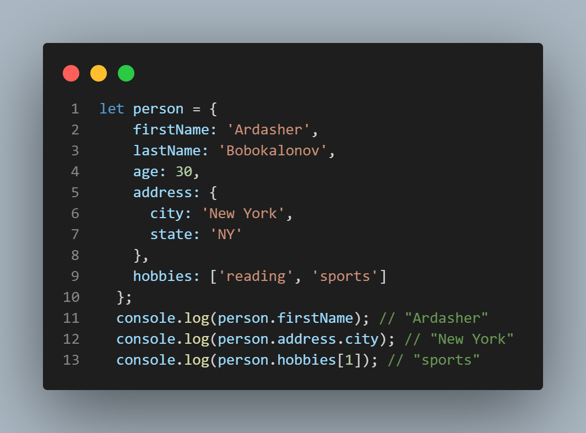
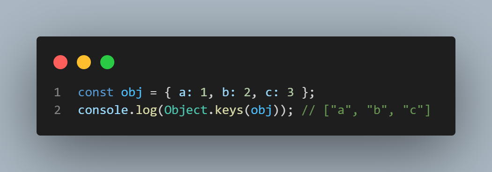
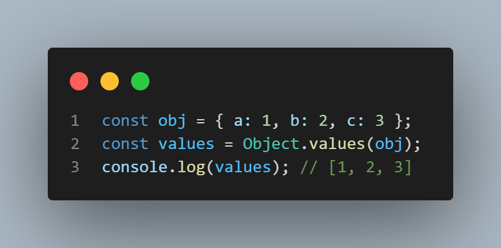
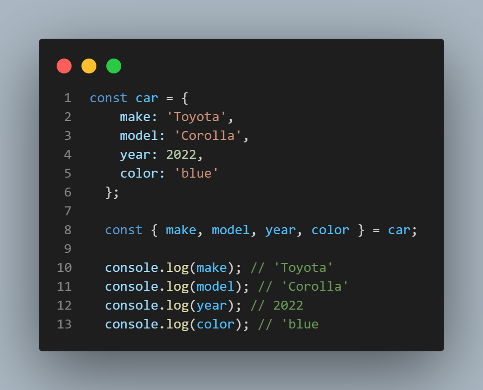
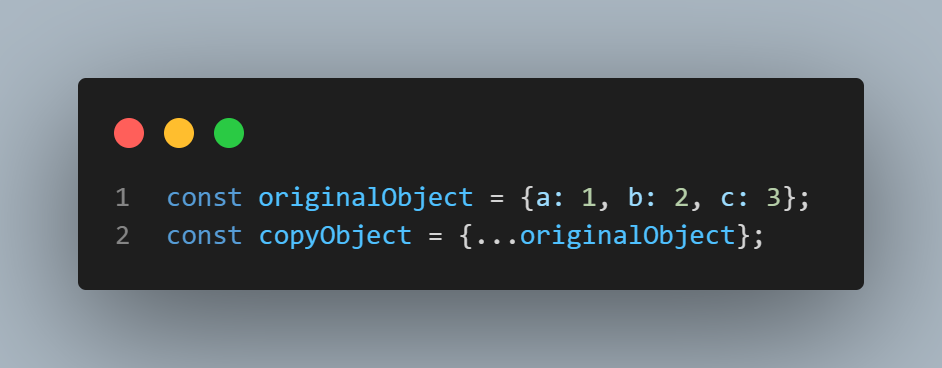
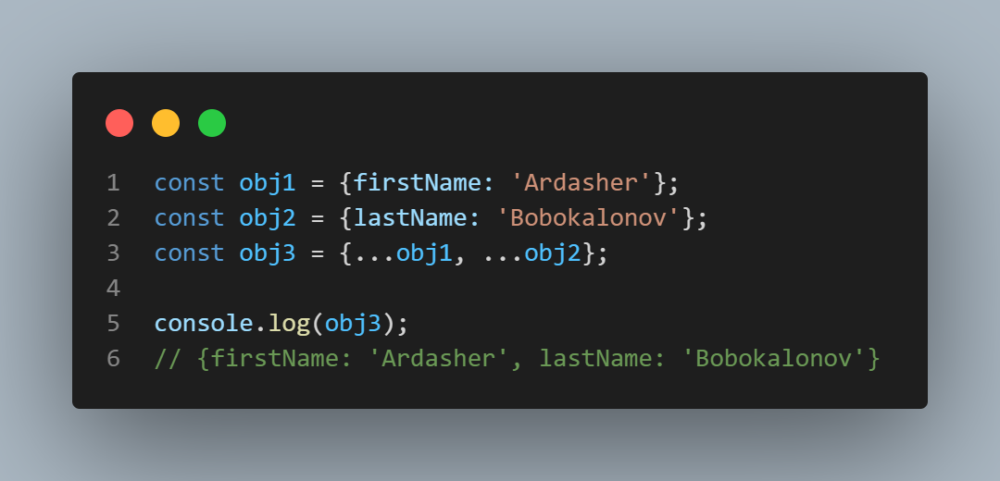
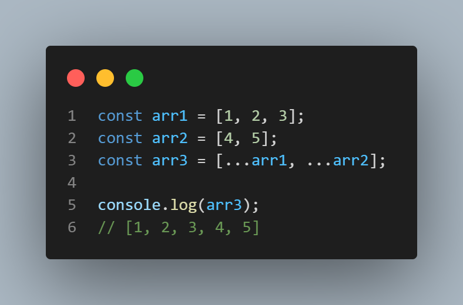
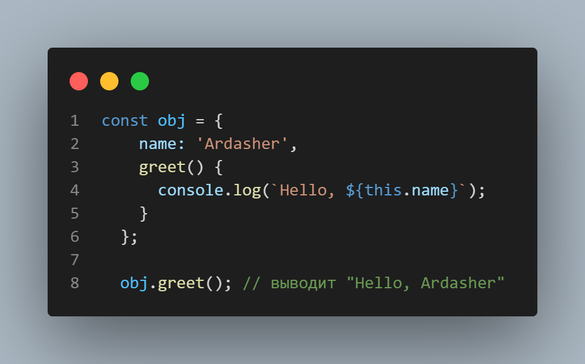
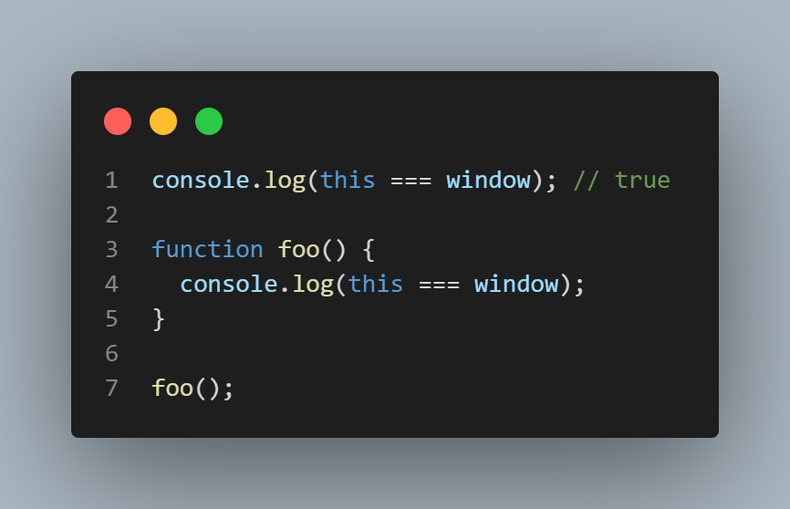
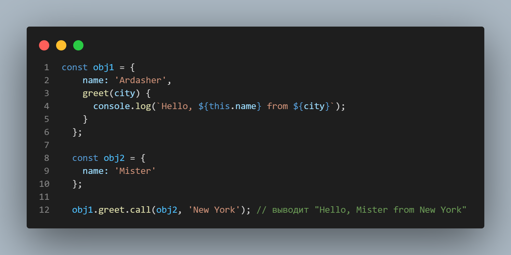

# Object

### What is an object in java script ?

**Объект в JavaScript** - это коллекция свойств (ключей) и методов, связанных с переменной. Объект может содержать произвольные названия свойств и их значения, которые могут быть любого типа, в том числе другие объекты и функции. Объекты в JavaScript являются динамическими, то есть свойства и методы могут быть изменены или добавлены в любое время, а также объекты могут быть переданы по ссылке. Практически любой элемент в JavaScript является объектом, включая функции и массивы. Объекты используются для организации кода, управления данными и группирования связанных операций вместе.

***Example:***

***Все является объектом в JavaScript***

***Объект JavaScript*** — это непримитивный тип данных, который позволяет вам
хранить несколько коллекций данных

********
### Methods object

***Object.entries()***

`Object.entries()` является методом объекта JavaScript, который возвращает массив, содержащий все собственные перечисляемые свойства объекта в виде массивов [key, value], в том же порядке, в котором они были обнаружены с помощью цикла `for...in`(за исключением того, что объект сначала преобразуется в массив с помощью метода `Object.keys()`).

***Object. keys()***

`Object.keys()` в JavaScript это стандартный метод, который используется для получения массива из всех ключей объекта. 

Этот метод возвращает массив, содержащий имена свойств, которые являются перечисляемыми (enumerable) для данного объекта. 

***Пример:***

 В данном примере мы создали объект `obj`, содержащий три свойства: `a`, `b` и `c`. Метод `Object.keys(obj)` возвращает массив из имен свойств, соответствующих ключам в объекте, так что мы получаем `["a", "b", "c"]`. 

 Этот метод может быть очень полезным во многих ситуациях, например, когда необходимо получить список всех ключей в объекте для последующей обработки или вывода на экран.

***Object. values()***

В JavaScript метод `Object.values()` возвращает массив значений свойств объекта в том порядке, в котором они были перечислены при обходе объекта свойствами в цикле.

***Пример использования `Object.values()`:***

В этом примере метод `Object.values()` возвращает массив значений свойств объекта `obj`, который содержит числовые значения 1, 2 и 3. 

`Object.values()` возвращает массив только для свойств с флагом `Enumerable = true`. Так же, метод не учитывает свойства прототипов объекта.

*****

### Destracturing and Spread in Object

***Деструктуризация объекта в JavaScript*** – это процесс извлечения значений свойств объекта и присваивание их локальным переменным. Это позволяет уменьшить количество кода, написанного для доступа к свойствам объекта, и упростить обращения к ним.

***Пример деструктуризации объекта:***

В данном примере создается объект `car`, содержащий информацию об автомобиле. Затем создаются локальные переменные `make`, `model`, `year`, `color`, которые принимают значения из соответствующих свойств объекта `car`, используя синтаксис деструктуризации. Наконец, выводятся значения этих переменных в консоль.

Деструктуризация объектов похожа на деструктуризацию массивов. Однако, вместо индекса элемента мы используем имя свойства объекта. Кроме того, при деструктуризации объектов можно задавать значение по умолчанию для свойств, которые отсутствуют в объекте:

**const { make = 'Unknown', model, year, color, price = 0 } = car;**

В данном примере, если свойство `make` отсутствует в объекте `car`, то переменная `make` будет присвоена значению 'Unknown'. Аналогично, если свойство `price` отсутствует в объекте, то переменной `price` будет присвоено значение 0.

### Spread 

***Метод***  `Spread` - в JavaScript используется для объединения двух или более объектов в один объект. Он позволяет распылить элементы и вставить их в новый массив или объект. 

***Например***, чтобы скопировать объект в JavaScript можно использовать `Spread` оператор в следующем виде:

Здесь мы создаем новый объект `copyObject`, используя оператор распространения и копируем свойства объекта `originalObject`. Далее можно вносить изменения в копию объекта, не затрагивая оригинальный объект. 

Также `Spread` оператор можно использовать для объединения двух или более объектов в один:

Здесь мы создаем новый объект `obj3`, используя оператор распространения для объединения свойств `obj1` и `obj2`.

`Spread` оператор также может применяться к массивам. Например, чтобы объединить два массива в один:

Здесь мы создаем новый массив `arr3`, используя оператор распространения для объединения элементов массивов `arr1` и `arr2`.

******

### Keyword "this"

**What is keyword "this" in js?**

***Ключевое слово*** `this` - в JavaScript ссылается на текущий объект, которому принадлежит текущий контекст выполнения. Значение `this` зависит от того, как вызвана функция, в которой используется данное ключевое слово. 

Если функция вызвана как метод объекта, т.е. через точку, то `this` ссылается на этот объект. 

***Например:***

Если функция вызвана в глобальной области видимости, то `this` ссылается на глобальный объект `window` в браузере и `global` в Node.js. Например:

Если функция вызвана с помощью методов `.call()`, `.apply()` или `.bind()`, то значение `this` определяется явным образом. Например:

