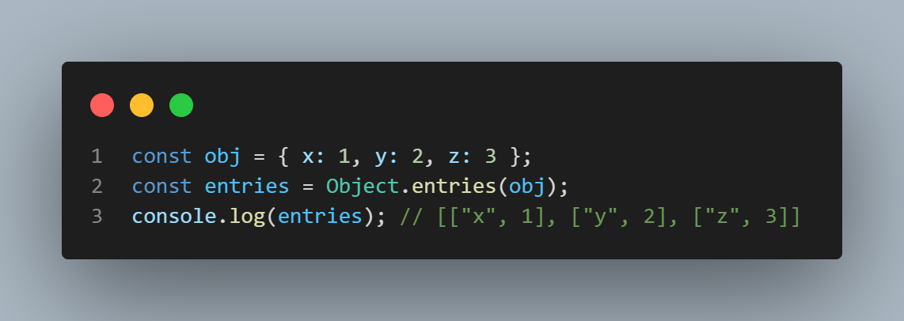

# Object

### What is an object in java script ?

**Объект в JavaScript** - это коллекция свойств (ключей) и методов, связанных с переменной. Объект может содержать произвольные названия свойств и их значения, которые могут быть любого типа, в том числе другие объекты и функции. Объекты в JavaScript являются динамическими, то есть свойства и методы могут быть изменены или добавлены в любое время, а также объекты могут быть переданы по ссылке. Практически любой элемент в JavaScript является объектом, включая функции и массивы. Объекты используются для организации кода, управления данными и группирования связанных операций вместе.

***Example:***

***Все является объектом в JavaScript***

***Объект JavaScript*** — это непримитивный тип данных, который позволяет вам
хранить несколько коллекций данных

********
### Methods object

***Object.entries()***

`Object.entries()` является методом объекта JavaScript, который возвращает массив, содержащий все собственные перечисляемые свойства объекта в виде массивов [key, value], в том же порядке, в котором они были обнаружены с помощью цикла `for...in`(за исключением того, что объект сначала преобразуется в массив с помощью метода `Object.keys()`).

***Object. keys()***

`Object.keys()` в JavaScript это стандартный метод, который используется для получения массива из всех ключей объекта. 

Этот метод возвращает массив, содержащий имена свойств, которые являются перечисляемыми (enumerable) для данного объекта. 

***Пример:***

 В данном примере мы создали объект `obj`, содержащий три свойства: `a`, `b` и `c`. Метод `Object.keys(obj)` возвращает массив из имен свойств, соответствующих ключам в объекте, так что мы получаем `["a", "b", "c"]`. 

 Этот метод может быть очень полезным во многих ситуациях, например, когда необходимо получить список всех ключей в объекте для последующей обработки или вывода на экран.

***Object. values()***

В JavaScript метод `Object.values()` возвращает массив значений свойств объекта в том порядке, в котором они были перечислены при обходе объекта свойствами в цикле.

***Пример использования `Object.values()`:***

В этом примере метод `Object.values()` возвращает массив значений свойств объекта `obj`, который содержит числовые значения 1, 2 и 3. 

`Object.values()` возвращает массив только для свойств с флагом `Enumerable = true`. Так же, метод не учитывает свойства прототипов объекта.